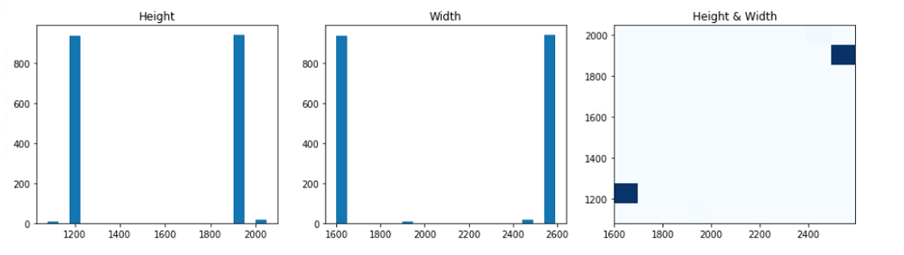
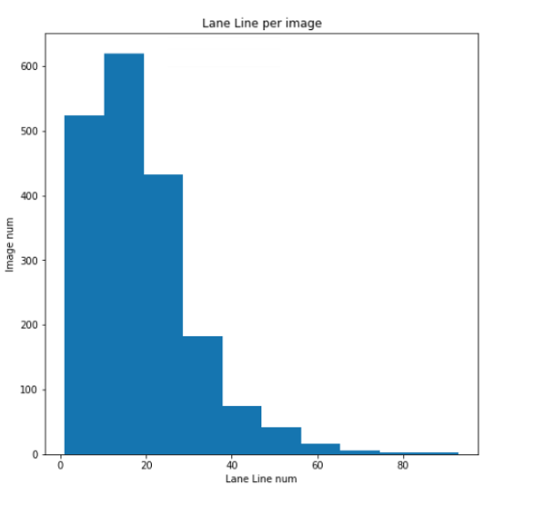
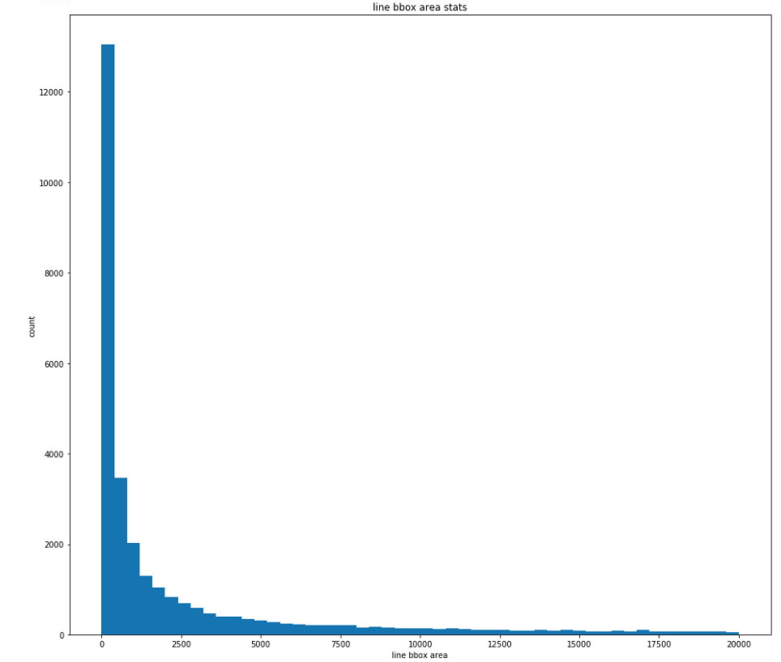
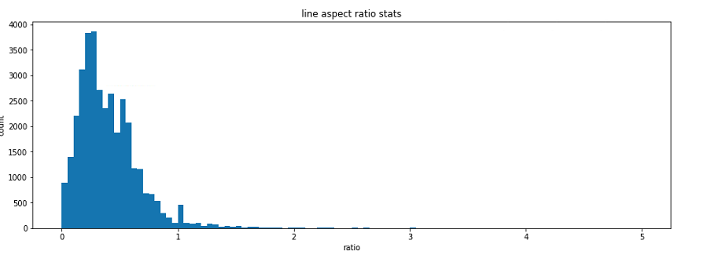
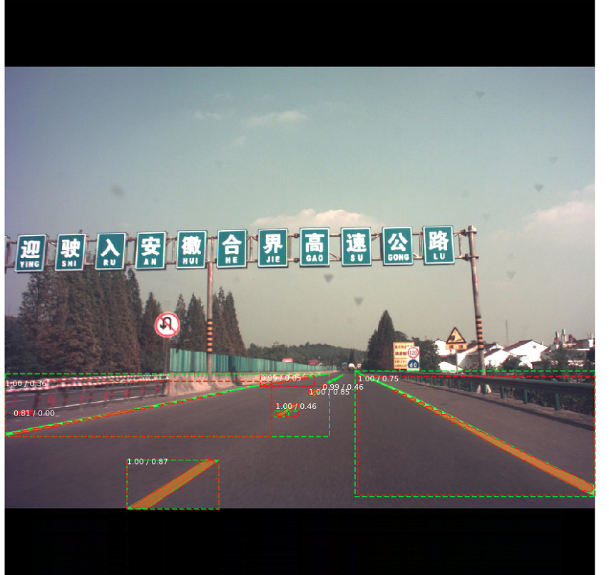
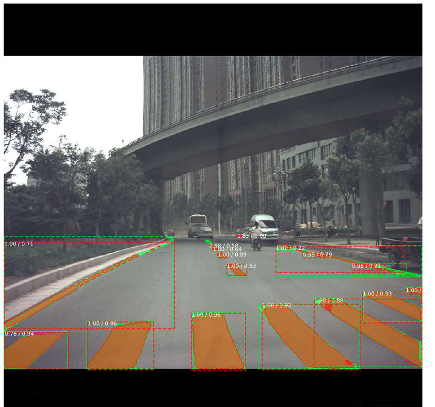
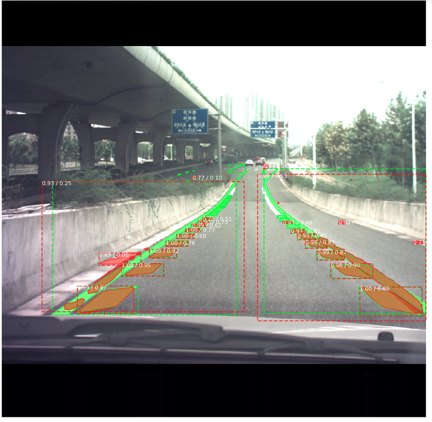
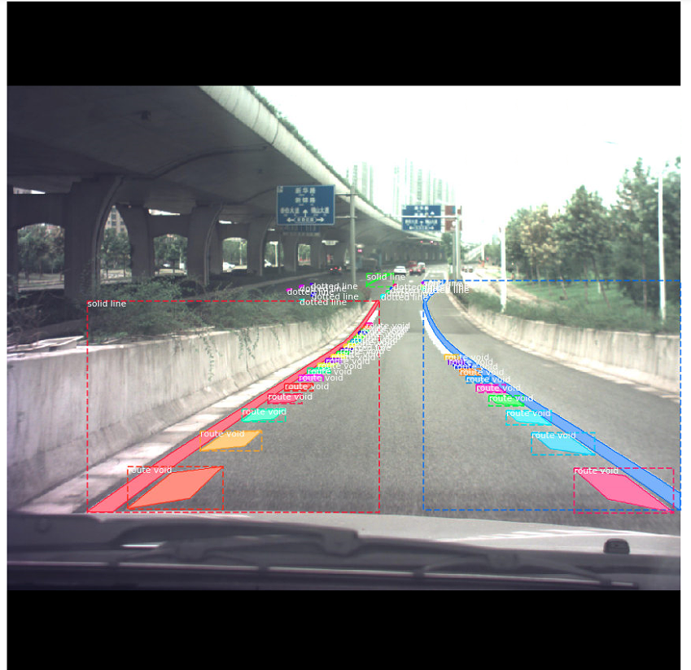

# Lane Line Detection and Segmentation

> Mask R_CNN模型代码使用tensorflow+keras实现的开源库[mask r-cnn](https://github.com/matterport/Mask_RCNN)

详细的数据集和结果查看，见[git 仓库](https://bitbucket.org/chushan/carlanedetection/overview).
 仓库内的jupyter有详细过程。

## 数据介绍

1. 图片大小统计



2. 图片中车道线数量统计



3. 图片中车道线bbox大小统计



4. 图片车道线bbox Aspect Ratio统计



5. 车道小bbox细化统计

x | 小于16*16 | 小于32*32 | 小于96*96|总共|
---|---|---|---|---
count|10847|17767|26947|35706


## 训练策略

BaseConfig:
- Weight decay: 1e-4
- Learning_rate: 1e-3
- Learning_momentum: 0.9

### From scratch
Weight: Imagenet pre-trained resnet50

Training:

- stage1:
    40 epochs， heads
- stage2: 
    120 epochs, all layers
    
### COCO Pret-trained
Weight: coco pre-trained mask r-cnn

Training:
- 120 epochs, all layers

## 评估
```python
# According to COCO
b : bbox_size
AP_s: b < 32*32
AP_m: 32*32 <= b < 96*96
AP_l : 96*96 <= b

# Addition
AP_ss: b< 16*16
```

 model| train_data| AP_50|AP_s|AP_m|AP_l | AP_ss
---|--- | --- | --- |--- | --- | --- 
mask rcnn | ori |39.6 |22.2 | 38.8|21.6 | 10.8
mask rcnn | ori + coco|42.3| 22.9|40.9|23.4|11.1


## 结果展示与分析

### 结果实例
绿色为未匹配到的分割实例，棕色为匹配到的分割实例，红色为错误匹配的分割实例

1. 示例一



2. 示例二



3. 示例三



### 分析

1、示例三对应的GT




从示例三和示例三的GT可以看出，无论是分割实例过小，还是过长，都会导致检测和分割失败。

## 总结

1. COCO pre-train 可以提高3个百分点。这是训练集较小的原因
2. mAP50在small和large size下效果比较差。这个现象也可以在上节的分析中可以看出。
3. 数据集中有大量的很小的分割实例。如size小于16*16的，占有大概1/3。但是从效果mAP_ss可以看出，这部分的实例很难被正确分割，最终结果很差。
4. 提高效果可能需要的方案：
    - 调参。目前仅仅使用默认的配置训练
    - 对很小的实例检测分割失败的现象进行分析解决